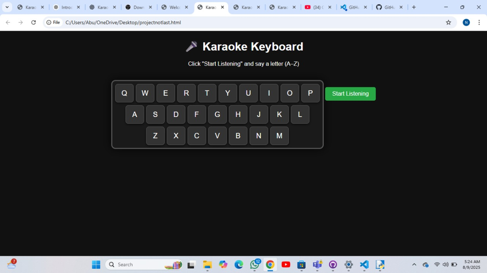
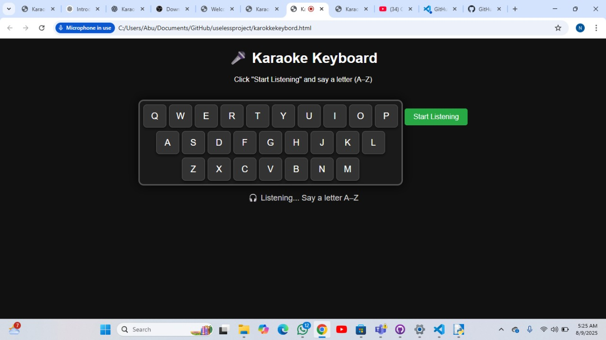
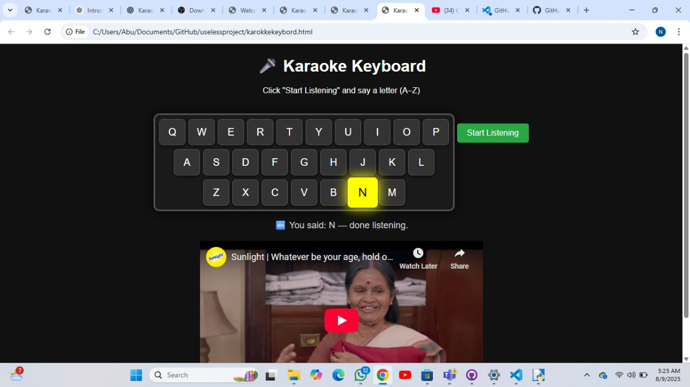

# [Karokke keyboard] 🎯


## Basic Details
### Team Name: [Kunjatta]


### Team Members
- Team Lead: [Majith_Rahman] - [Govt engineering college idukki]
- Member 2: [Niveda_S] - [Govt engineering college idukki]

### Project Description
[This project is a fun, interactive web app where you say a letter aloud, the keyboard lights up the corresponding key, and a YouTube video (song) assigned to that letter plays below the keyboard. It uses voice recognition to detect the spoken letter and embeds YouTube videos for karaoke fun..]

### The Problem (that doesn't exist)
[There isn't a straightforward, fun way to combine voice input with a virtual keyboard to lights up and instantly play related songs based on a letter input]

### The Solution (that nobody asked for)
[An entertaining voice-controlled karaoke keyboard that highlights the spoken letter and plays a corresponding YouTube song embedded directly under the keyboard for seamless interaction.]

## Technical Details
### Technologies/Components Used
For Software:  
- HTML5, CSS3, JavaScript  
- Web Speech API (webkitSpeechRecognition) for voice recognition  
- YouTube Embedded Player (iframe)  

For Hardware:
- Any microphone (built-in or external)  
- Desktop or mobile device with a modern web browser (Google Chrome recommended for best compatibility)  

### Implementation
For Software:
The application listens to voice input for a single letter (A-Z). Upon recognizing a valid letter, it highlights the corresponding key on a QWERTY keyboard displayed on the screen and plays the assigned YouTube video embedded below the keyboard.
# Installation
1. Clone the repository:  
   ```bash
   git clone [https://github.com/yourusername/karoke-keyboard.git]


# Run
-[Open the project in your browser.
-Click the Start Listening button.
-Speak a letter (A-Z) clearly into your microphone.
-The corresponding keyboard key will highlight, and the associated YouTube karaoke song will play just below the keyboard.]

### Project Documentation
For Software:

# Screenshots (Add at least 3)

The QWERTY keyboard layout with keys that light up when you say a letter.


The status bar shows when the app is listening and displays the detected letter.


Embedded YouTube player below the keyboard playing the assigned song.

## Team Contributions
- [Niveda S]: [voice recognition integration,keyboard layout coding]
- [Majith Rahman]: [YouTube video embedding,README]

---
Made with ❤ at TinkerHub Useless Projects 


